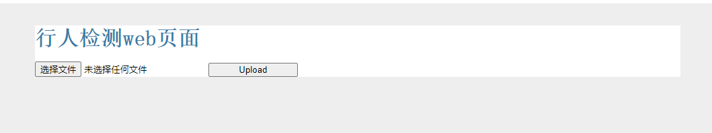
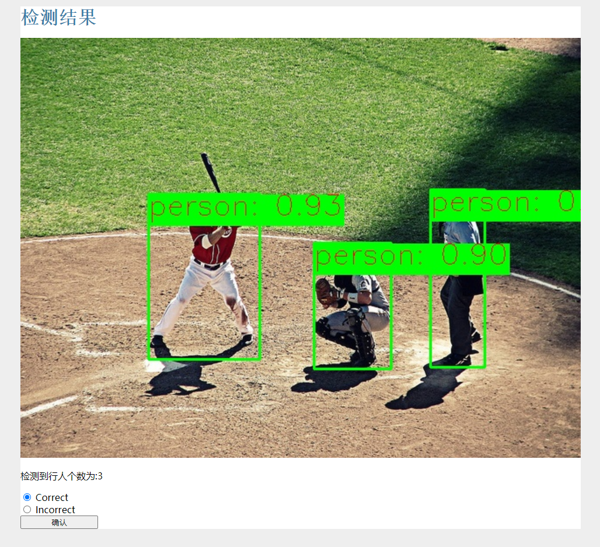
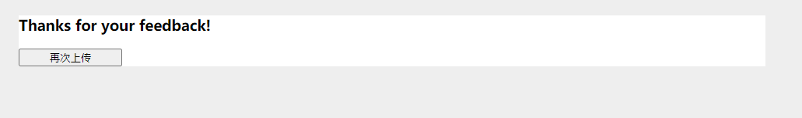

# person_detect_web
用yolox进行行人检测，并在网页端展示结果

1.下载工程

> git clone https://github.com/lishanlu136/person_detect_web.git

2.执行文件web_service.py

> cd person_detect_web   
python web_service.py

3.在网页打开链接http://127.0.0.1:5000/

4.展示效果  

5.致谢  
感谢[YOLOX工程](https://github.com/Megvii-BaseDetection/YOLOX),关于yolox的配置请参考这个项目。